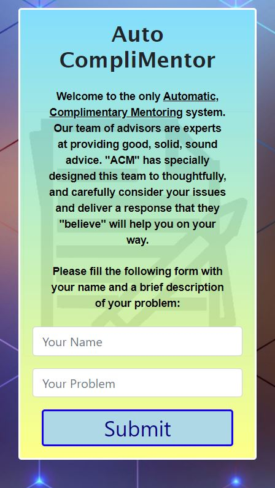
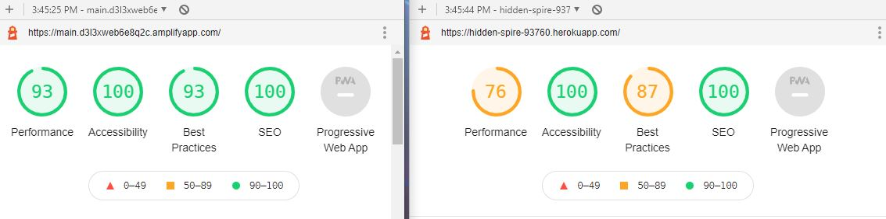

# Auto Compli-Mentor

## Introduction

Auto Compli-Mentor is a mentoring system for any person in need of advice or encouragement. Submit your problems to our team of Auto-Experts and you will be provided Complimentory Mentoring!

[Auto Compli-Mentor on Heroku!](https://hidden-spire-93760.herokuapp.com/)

[Auto Compli-Mentor on AWS!](https://main.d3l3xweb6e8q2c.amplifyapp.com/)

## Getting Started
If you are cloning this repo to host on your own local machine please be sure to send "npm i" to ensure you have all required React and Node.js modules. 

## Under the Hood
### React
React is a node.js tool that has a lot of potential not yet unlocked ont his application. This app is a "begginer's" project that aims to simply demonstrate the basic functionality of how React renders basic page elements and how those elements respond to changes in their states. The major complications in this application are:
* parent-child state transfers
* async methods which ultimately change the state
* when to use "traditional" js modules for advanced processing OR JSX constructors, methods, and rendering tools

### Heroku
Heroku provides the platform from which this React, Node.js application can run. It does not have a true "back-end" at this time, no database, simply a long array of content.

### AWS
AWS is an Amazon-owned tool for website deployment. They offer free hosting with randomized URL paths. Trying it out here as a demonstration.

## Host Lighthouse Comparison

### 3rd Party API - Async
Webster's Dictionary provides a free API for definition lookups. Single-word queries return an array of definitions and within those definitions are the "word type" attribute which is key for decoding the content submitted by the user

### Language Decoding
Language, english in particular, is very challenging to "decode" and inject into template statements. Considerations like:
* Is there a "definite article" such as the word "the": we want to keep that.
* Which noun in a sentence is the "subject". This app assumes the first noun (that isn't he word "I") is the subject.
* "My" and "I" are handled similarly. It is replaced by "your" and in many cases is sounds either correct or funny.
* Does the subject-noun have "helper" or "related" words surrounding it? Adjectives we want to keep, this app keeps the preceding adjective. A related noun is for concepts like "hat hair" which are nouns that mean something else when combined. This app keeps up to THREE words in a row in and around the first found noun.
* "I am" or "I'm" are a whole other beast. Usually ending in an adjective of some sort, replacing "I am / I'm" with "being" might be a short-stop fix for that

The other way to get around confusion is to build the template responses in such a way that they can accept "plural" or "singular" nouns. They must be ambiguous. This is where creativity comes into play. These "mentors" are meant to sound like "tin boxes" where they aren't really listening to you. Like a "bot" or, more to this app's focus, un-caring sources of advice, the generated responses are actually meant to sound kind of like the "mentor" isn't paying attention, doesn't understand whatever it is you are talking about, or completely misunderstands whatever it is you wrote. Injecting actual strings is why its interesting, the string content is why it's "funny".

In short, it's a feature, not a bug.

Here's a real list of bugs:
* Sentences that end in adjectives and contain "are", like "My feet are stinky" gives back "feet are". No good.
* Sentences where "I am"/"I'm" are followed by "being" such as "I'm being a brat". Being is repeated. (fixed 03-30-21)
* Sentences staring with "a" like "a big baby". "A" is a noun and not developed to be considered.

## Future Implementations

### MongoDB
One major improvement this app is ready for is integration to Mongo. The "database" in this app is just a large array of objects. This could be converted to a "seed" for a mongo database. Challenges in this would be that the querying of that db would be asynchronous as well.

### Big Concepts
With MongoDB is the potential to integrade more CRUD operations.
* Users "vote" on replies they found useful. If a mentor has more votes, that could resolve into some logic that affects if that particular mentor appears more often than not.
* User-specific statistics. Perhaps the mentors don't all display each time, maybe some are "rare", and depending on how much the user uses the app, the more rare mentors appear. 
* Another perhaps more fun idea would be to allow users to give thumbs up/down on mentor responses. The more downs you give, the angrier and hostile the mentor gets. It may even get to the point that they no longer appear for you. The more positive, the more you might learn about that mentors potentially interesting backstory. Integrating to MongoDB would be making it user-specific the "state" of each mentor's "mood" as you give up/downs to messages. I would also have their background DIVs turn firey as they became more upset, and "heavenly" as they came to love you.

## Credits

Erik Portillo

March 2021